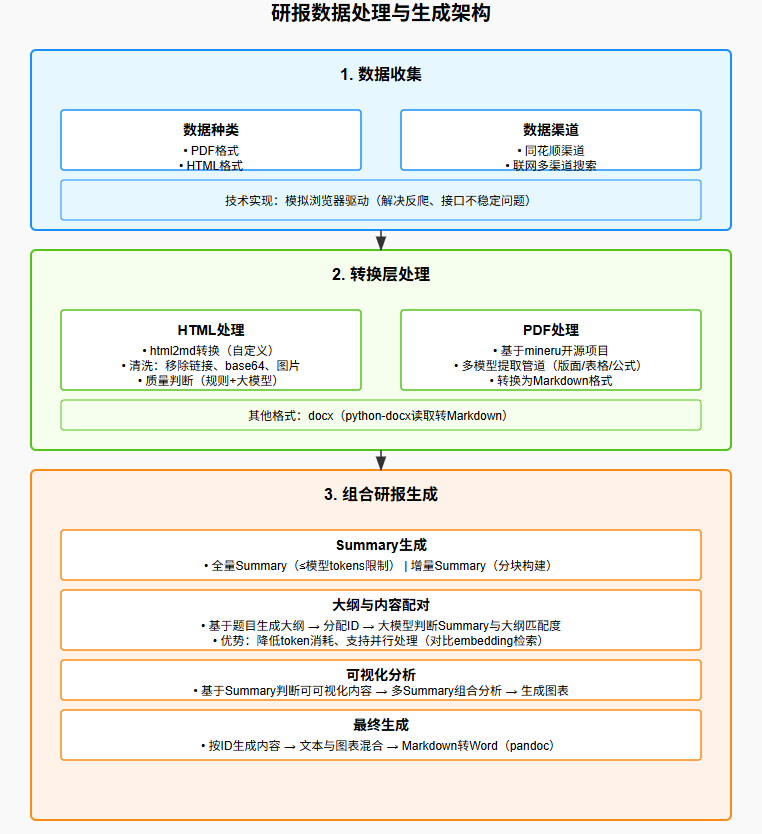
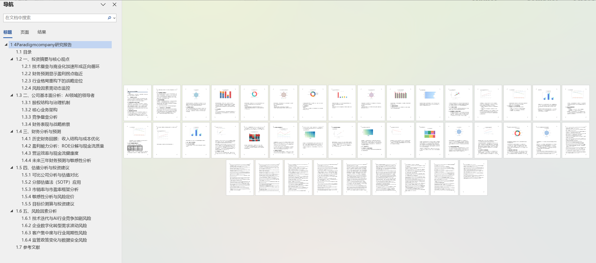
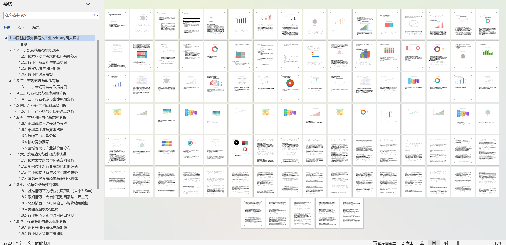
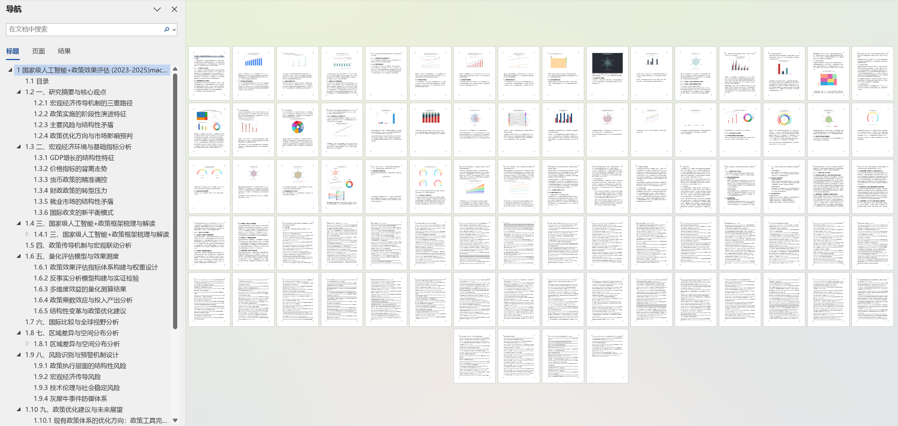

## 项目架构以及说明


在数据收集环节，从数据种类上主要分为 pdf 和 html 两种类型；从渠道来看，采用了同花顺渠道以及基于联网搜索的多渠道搜索方案。

选择这两种方案的原因如下：一方面，同花顺平台上的数据十分丰富，一旦成功爬取，在公司研报方面，基本上能够满足大部分甚至全部的数据需求，所以将其作为优质数据源单独列出。另一方面，基于逆向的搜索引擎，让我们能够通过关键词或查询语句的方式，突破单一数据源的限制。这种方式不仅不限于特定的交易所或公开免费数据获取渠道，借助关键词或高级查询语句，还可以一次性穿透交易所、政府公开库、资讯站点等众多免费或半公开渠道，从而在公司研报环节补充同花顺未覆盖的信息。而在行业研报和宏观研报的数据获取过程中，主要依靠联网搜索获取导航 url，为后续深入挖掘信息搭建桥梁。

然而，数据收集过程困难重重。网络上大部分网页设置了反爬机制，基于逆向的联网搜索引擎接口也极不稳定，容易出现限速问题，导致无法访问。为此，我们团队采用模拟浏览器驱动的方式，实现了本次比赛所需的联网搜索功能。同样，获取同花顺上的公司信息及数据，也是通过基于浏览器驱动访问网页来实现的。

找到数据后，还需进行转换层处理，因为 html 或 pdf 格式并不适合直接与大模型交互。html 格式常包含大量 js、css 样式以及 base64 编码等内容，很容易使模型上下文超出最大 tokens 限制。所以，需要对 html 内容进行初步加工。在此过程中，主要运用了 html2md 处理，将 html 转换为 markdown，但这并非简单的格式转换。因为转换后的 markdown 依然存在数据噪声，例如大量链接语法，且可能使用相对地址。网页通常每页都带有导航栏，形式多样，包括头部导航、左侧边栏导航、底部导航等。实际上，html 转换成的 markdown 存在诸多问题，我们所做的初步清洗是结合实际场景开展的。首先集成 markdownify 库，实现自定义的 markdown 转换，在此基础上，进一步进行清洗处理，去除 markdown 中的 base64、链接、图片信息。考虑到网上搜索获取的信息质量参差不齐，在最后环节，基于规则和大模型构建了质量判断逻辑，使 html 内容初步达到可用标准。

对于 pdf 格式，多数情况下解析难度极大，除非是极少数纯文本类型。提取其中的文本、表格、公式等内容困难重重。为此，我们团队基于开源项目 mineru 搭建了提供 pdf 转换功能的 api 服务。其底层采用多模型提取管道，涵盖版面检测、公式检测、表格检测、图片检测、OCR、公式识别、表格识别等环节。虽然提取效果并非完美无缺，但与商用方案相比差距不大，对于我们的应用场景而言，已达到可用且效果良好的程度。通过 mineru，能够将 pdf 直接转换成 markdown 格式的文本内容。此外，对于其他格式如 docx，使用 python - docx 进行读取并转换为 markdown 即可。

当搜集好数据并转换为合适的 markdown 格式后，便进入组合研报生成环节。实际上，对于整个赛题，高质量数据的收集至关重要，因为数据质量的高低直接决定了内容的质量上限。受限于只能使用公开免费的网络数据，难以避免模型幻觉问题。我们虽无法杜绝模型幻觉，但可以采取措施降低其出现的概率。

我们收集到的数据基本以 {title,url,md,data_source_type} 结构存储，分别对应标题、链接地址、markdown 内容、数据源类型（数据源类型分为 html、pdf 和 docx）。数据处理的第一步是在此基础上添加一个 summary 字段。由于从网页提取的信息，其 token 量级往往可达几十 k，几乎没有模型能够承载多个网页的 markdown 内容。虽然存在内容较少的 markdown 页面，但占比较少，因此默认每个 markdown 内容可能超出模型上下文空间。所以，需要对内容进行初步压缩描述，即生成所需的 summary 字段。实际处理时，生成两种类型的 summary 字段：一种是全量的 summary，其 tokens 不超过大模型的上下文空间；另一种是增量型 summary，针对超出大模型记忆上限的内容，按照 token 进行分块处理，以大模型最大记忆 tokens 的 80% 作为一块，通过多次增量式 summary 构建完整的内容摘要。构建好 summary 后，相当于为大模型构建了索引，后续很多工作都围绕 summary 展开。

此时，有必要将我们的方法与 RAG 常用的 embedding 检索环节进行对比。RAG 基于 embedding 召回内容，而我们使用 summary 让大模型召回内容。embedding 索引仅能通过 embedding 模型基于 cos 等相似度进行判断，导航性能几乎为零，只能进行相似度过滤操作。而 summary 能够为大模型提供基础的内容描述，使大模型了解内容用途及所含信息，并基于 summary 进行一定判断。虽然这种判断不一定完全准确，但相比 embedding，其可用性要高得多，以下详细阐述。

在使用 summary 之前，需根据题目需求生成大纲内容。获取 summary 后，为每个大纲内容分配 id，这是一个非常巧妙的思路。若采用 RAG 基于 embedding 召回内容的思路，首次召回可能无法获取所需内容，需要多次反思并以迭代方式寻找相关内容。但根据实际测试，效果并不理想。因为 embedding 的上下文也有限，需要对内容进行二次分割，这会导致信息进一步损失。而且反复反思也难以积累信息，无法很好地回答问题，最终输出内容仅适用于简短问题，不适合生成内容。当然，若转换思路，通过召回判断内容是否有用，有用则摘抄，无用则重新检索，理论上或许可行。

对比基于 summary 直接按照大纲进行内容配对的方式，基于大纲进行内容配对优势明显。例如，先撰写好大纲，明确每个大纲所需内容，然后利用大模型结合 summary 判断内容与大纲块是否相符，若相符则记录配对。这种方式能让大模型在生成内容时，清楚可从哪些环节寻找对应内容。对比 embedding 主动找内容和 summary 自动配对被找的方式，在研报生成场景中，自动配对的方式更具优势。因为我们无需每次遍历所有内容来判断能否回答问题。从任务角度看，我们的核心是围绕大纲生成内容，不应是主动找内容，而是被找。我们无需维护内容用于下一次主动检索，而是先通过启发式搜索找到一批内容并进行配对。若发现内容不足，再进行主动搜索并继续配对。从这个角度看，token 消耗总体上有所减少。因为 embedding 部分需要检索判断相关性，还可能需要重写，而直接根据大纲配对，token 消耗则少很多。从并行角度看，我们的方案可以进行并行配对，而基于 embedding 反思后继续检索是串行的，所以在速度上，我们的方案也具有很大优势。

配对完成后，虽已可以进行问题回答或内容撰写，但缺少图，因此需要加入数据分析和图表绘制环节。基于 summary，先让大模型判断哪些 summary 适合进行可视化操作，并绑定相应内容。这里的精妙之处在于，同时加入多个 summary，让大模型判断这些 summary 组合能生成哪些可视化内容。接着，按照 id 对实际内容进行可视化。当然，还需判断当前内容能否完成可视化任务，若不能则跳过。经过对 id 导航字典的遍历，完成对已有数据的可视化分析结果生成。

在最后的生成环节，先让 AI 按照分配好的 id 进行内容生成，然后将生成的文本与分析绘制出的图表进行混合处理，使文本包含图片。最后，将生成的 markdown 结合 pandoc 输出为 word 文件。

下面以下是他的介绍。

# 智能研究报告生成系统

## 🎯 项目简介

智能研究报告生成系统是一个基于大语言模型的自动化研究报告生成工具，支持**公司研究报告**、**行业研究报告**和**宏观研究报告**三种类型的研究报告自动生成。系统集成了数据收集、数据处理、报告生成和图表增强等功能，提供从数据到报告的一站式解决方案。

## ✨ 核心特性

- 🤖 **智能数据收集**: 自动从多源网络收集相关数据和资讯
- 📊 **多类型报告**: 支持公司、行业、宏观三种研究报告类型
- 🎨 **图表自动生成**: 基于数据自动生成可视化图表
- ⚡ **统一命令行接口**: 一个命令完成从数据收集到报告生成
- 🔧 **灵活配置系统**: 支持多种API服务商和自定义配置
- 📈 **批量处理**: 支持批量生成多个报告
- 🌐 **多模型支持**: 支持火山引擎、硅基流动、智谱AI等多种模型
- 📄 **DOCX 导出**: 支持自动将 Markdown 报告转换为 DOCX 格式

## 效果示例
### 公司研究报告


### 行业研究报告


### 宏观研究报告


## 🏗️ 系统架构

```
gen_report/
├── 📋 配置与入口
│   ├── config.py                    # 统一配置管理
│   ├── generate_report.py           # 统一命令行入口
│   └── pyproject.toml              # 项目依赖配置
│
├── 🎯 专用报告生成器
│   ├── gen_report_company.py        # 公司报告专用生成器
│   ├── gen_report_industry.py       # 行业报告专用生成器
│   └── gen_report_macro.py          # 宏观报告专用生成器
│
├── 🔄 数据收集模块
│   ├── company_collect_data.py      # 公司数据收集脚本
│   ├── industry_collection_data.py  # 行业数据收集脚本
│   ├── macro_collection_data.py     # 宏观数据收集脚本
│   └── data_process/               # 数据处理核心模块
│       ├── company_data_collection.py
│       ├── industry_data_collection.py
│       └── macro_data_collection.py
│
├── 📝 报告生成核心
│   ├── unified_report_generator.py  # 统一报告生成器
│   ├── report_prompts.py           # 报告模板和提示词
│   └── run_*_research_report.py    # 独立运行脚本
│
├── 🧪 测试与示例
│   ├── test_integration.py         # 集成测试
│   ├── quick_run_examples.py       # 快速示例运行
│   └── tests/                      # 测试文件目录
│
├── 🔍 辅助服务
│   ├── search_server/              # 搜索服务
│   ├── md2docx/                    # 文档转换
│   └── caches/                     # 缓存目录
│
└── 📊 数据与输出
    ├── test_*_datas/               # 测试数据目录
    ├── images/                     # 生成的图表
    └── *.html                      # 数据源文件
```

## 🚀 快速开始

### 1. 环境准备

**本人系统配置（仅供参考）:**

- 💻 Windows 系统
- 🚀 64GB 内存
- 💾 2TB 硬盘
- 🎮 16GB 显存显卡（如笔记本 RTX 3080）

**必需软件:**

- Python 3.11+
- [uv](https://docs.astral.sh/uv/) 包管理器 或 [Conda](https://docs.conda.io/)
- [Pandoc](https://pandoc.org/) (用于 Markdown 转 DOCX)

#### 🐍 方式一：使用 Conda 环境（推荐）

**1. 安装 Conda**

如果还没有安装 Conda，请从以下链接下载安装：

- [Anaconda](https://www.anaconda.com/products/distribution) (完整版)
- [Miniconda](https://docs.conda.io/en/latest/miniconda.html) (轻量版)

**2. 创建并激活环境**

```bash
# 创建 Python 3.11 环境
conda create -n gen-report python=3.11

# 激活环境
conda activate gen-report

# 安装 pandoc（重要：用于 DOCX 转换）
conda install pandoc

# 验证 pandoc 安装
pandoc --version
```

**3. 安装项目依赖**

```bash
# 进入项目目录
cd gen_report

# 使用 pip 安装依赖
pip install -r requirements.txt

# 或者使用 conda 安装（如果有 conda-forge 版本）
# conda install --file requirements.txt -c conda-forge
```

#### ⚡ 方式二：使用 uv 环境

**1. 安装 uv**

```bash
# Windows (PowerShell)
powershell -c "irm https://astral.sh/uv/install.ps1 | iex"

# 或者使用 pip 安装
pip install uv
```

**2. 创建项目环境**

```bash
# 进入项目目录
cd gen_report

# 同步依赖（自动创建虚拟环境）
uv sync

# 验证环境
uv run python --version
```

**3. 安装 pandoc**

⚠️ **重要提示：** uv 环境下需要单独安装 pandoc

```bash
# 方式1：使用 conda 安装 pandoc（推荐）
conda install pandoc

# 方式2：Windows 下载安装包
# 从 https://pandoc.org/installing.html 下载 Windows 安装包

# 方式3：使用 chocolatey（如果已安装）
choco install pandoc

# 验证 pandoc 安装
pandoc --version
```

#### 🔍 环境验证

无论使用哪种方式，请验证环境配置：

```bash
# 检查 Python 版本
python --version  # 应该显示 Python 3.11+

# 检查 pandoc（用于 DOCX 转换）
pandoc --version

# 检查项目配置
python config.py

# 测试导入关键依赖
python -c "import openai, aiohttp, beautifulsoup4, playwright; print('✅ 核心依赖导入成功')"
```

#### 📦 依赖包说明

项目主要依赖包：

```
# 核心 AI 和 API
openai>=1.95.1              # OpenAI API 客户端
zhipuai>=2.1.5.20250724     # 智谱 AI API

# 网络请求和爬虫
aiohttp>=3.12.14             # 异步 HTTP 客户端
beautifulsoup4>=4.13.4      # HTML 解析
playwright>=1.53.0          # 浏览器自动化
selenium>=4.34.2            # Web 自动化
trafilatura>=2.0.0          # 网页内容提取

# 文档处理
python-docx>=1.2.0          # Word 文档处理
pypandoc>=1.15              # Pandoc Python 接口
markdownify>=1.1.0          # HTML 转 Markdown

# 数据处理和可视化
numpy>=2.3.1                # 数值计算
pyecharts>=2.0.8            # 图表生成
jieba>=0.42.1               # 中文分词

# 其他工具
python-dotenv>=1.1.1        # 环境变量管理
cachetools>=6.1.0           # 缓存工具
tiktoken>=0.9.0             # Token 计算
```

#### 🚨 常见问题解决

**问题1：pandoc 无法找到**

```bash
# 解决方案：确保 pandoc 在系统 PATH 中
where pandoc  # Windows
which pandoc  # Linux/Mac

# 如果没有找到，重新安装 pandoc
conda install pandoc
```

**问题2：uv run 报错**

```bash
# 解决方案：使用 conda 环境运行
conda activate gen-report
python generate_report.py --help
```

**问题3：依赖冲突**

```bash
# 解决方案：清理环境重新安装
# Conda 环境
conda remove -n gen-report --all
conda create -n gen-report python=3.11

# uv 环境
uv clean
uv sync
```

### 2. 安装依赖

```bash

cd gen_report

# 安装依赖
uv sync
```

### 3. 配置环境

创建 `.env` 文件并配置API密钥：

```bash
# 复制环境变量模板
cp .env.example .env

# 编辑配置文件
vim .env
```

必需的配置项：

```env
# API服务商配置
OPENAI_API_KEY=your_volcano_api_key
OPENAI_BASE_URL=https://ark.cn-beijing.volces.com/api/v3
OPENAI_MODEL=deepseek-v3-250324

GUIJI_API_KEY=your_guiji_api_key
GUIJI_BASE_URL=https://api.siliconflow.cn/v1

ZHIPU_API_KEY=your_zhipu_api_key

# 可选服务配置
PDF_BASE_URL=http://localhost:10001
SEARCH_URL=http://localhost:8000

# 搜索配置（默认使用本地搜索服务）
USE_ZHIPU_SEARCH=false
```

### 4. 配置辅助服务

#### PDF 解析服务（可选但推荐）

本系统的 PDF 解析功能基于mineru实现，并封转成了微服务 [remote_pdf_parse_serve](https://github.com/li-xiu-qi/remote_pdf_parse_serve) 实现，我们将其部署在了 A6000 服务器上提供远程 PDF 解析服务。

如需启用 PDF 解析功能：

1. 下载并部署 PDF 解析服务：

   ```bash
   git clone https://github.com/li-xiu-qi/remote_pdf_parse_serve
   cd remote_pdf_parse_serve
   # 按照项目说明进行部署
   ```

2. 在 `.env` 文件中配置服务地址：

   ```env
   PDF_BASE_URL=http://your_server:10001
   ```

#### 搜索服务（推荐）

系统支持两种搜索方式：

**方式1：本地搜索服务（推荐）**

项目包含本地搜索服务，基于 Playwright 实现，默认启用：

1. 启动搜索服务：

   ```bash
   cd search_server
   python search.py
   ```

2. 在 `.env` 文件中配置：

   ```env
   SEARCH_URL=http://localhost:8000
   USE_ZHIPU_SEARCH=false  # 默认值，使用本地搜索
   ```

**方式2：智谱搜索服务**

如果需要使用智谱搜索服务，可以在 `.env` 文件中配置：

```env
USE_ZHIPU_SEARCH=true
ZHIPU_API_KEY=your_zhipu_api_key
```

**注意：** 系统默认使用本地搜索服务，这样可以避免额外的API调用费用。

### 5. 验证配置

```bash
# 检查配置状态
uv run python config.py
```

### 6. 生成报告

#### 🏢 公司研究报告

```bash
# 基础用法 - 仅生成 Markdown（自动查找 test_company_datas 目录）
uv run generate_report.py company --company_name "4Paradigm"

# 带公司代码
uv run generate_report.py company --company_name "商汤科技" --company_code "00020.HK"

# 指定数据目录（推荐，避免重复数据收集）
uv run generate_report.py company --company_name "4Paradigm" --data_dir "test_company_datas"

# 自定义输出路径
uv run generate_report.py company --company_name "4Paradigm" --output "reports/4paradigm_report.md"

# 使用便捷脚本（支持 DOCX 转换） - DOCX 文件输出到 reports 目录
python run_company_research_report.py --company_name "4Paradigm" --to_docx

# 指定数据目录并转换为 DOCX
python run_company_research_report.py --company_name "4Paradigm" --data_dir "test_company_datas" --to_docx

# 自定义 DOCX 输出路径
python run_company_research_report.py --company_name "4Paradigm" --to_docx --docx_output "reports/4paradigm_report.docx"
```

#### 🏭 行业研究报告

```bash
# 基础用法 - 仅生成 Markdown
uv run generate_report.py industry --industry_name "中国智能服务机器人产业"

# 特定行业
uv run generate_report.py industry --industry_name "智能风控&大数据征信服务"

# 指定数据目录（推荐，避免重复数据收集）
uv run generate_report.py industry --industry_name "中国智能服务机器人产业" --data_dir "test_industry_datas"

# 使用便捷脚本（支持 DOCX 转换） - DOCX 文件输出到 reports 目录
python run_industry_research_report.py --industry_name "中国智能服务机器人产业" --to_docx

# 指定数据目录并转换为 DOCX
python run_industry_research_report.py --industry_name "中国智能服务机器人产业" --data_dir "test_industry_datas" --to_docx
```

#### 🌏 宏观研究报告

```bash
# 基础用法 - 仅生成 Markdown
uv run generate_report.py macro --macro_name "人工智能+政策效果评估"

# 指定时间范围
uv run generate_report.py macro --macro_name "生成式AI基建与算力投资趋势" --time "2023-2026"

# 指定数据目录（推荐，避免重复数据收集）
uv run generate_report.py macro --macro_name "国家级人工智能+政策效果评估" --time "2023-2025" --data_dir "test_macro_datas"

# 使用便捷脚本（支持 DOCX 转换） - DOCX 文件输出到 reports 目录
python run_macro_research_report.py --macro_name "国家级人工智能+政策效果评估" --time "2023-2025" --to_docx

# 指定数据目录并转换为 DOCX
python run_macro_research_report.py --macro_name "国家级人工智能+政策效果评估" --time "2023-2025" --data_dir "test_macro_datas" --to_docx
```

## 📁 目录结构管理

### 输出目录结构

系统会自动管理以下目录结构：

```bash
gen_report/
├── 📊 数据目录
│   ├── test_company_datas/          # 公司数据
│   ├── test_industry_datas/         # 行业数据
│   └── test_macro_datas/            # 宏观数据
│
├── 📄 报告输出目录
│   └── reports/                     # DOCX 报告统一输出目录
│       ├── Company_Research_Report.docx
│       ├── Industry_Research_Report.docx
│       ├── Macro_Research_Report.docx
│       └── custom_reports/          # 自定义报告子目录
│
└── 🔧 其他文件...
```

**输出目录特性：**

- 🗂️ **自动创建**：系统会自动创建 `reports` 目录
- 📋 **统一管理**：所有 DOCX 报告默认输出到 `reports` 目录
- 🎯 **灵活配置**：支持通过 `--docx_output` 参数自定义输出路径
- 🔄 **版本管理**：避免文件散落在项目根目录

## 📁 数据目录管理

### 自动数据目录查找

系统会按以下优先级自动查找数据目录：

1. **用户指定目录**：通过 `--data_dir` 参数指定的目录
2. **通用数据目录**：自动检查通用目录（如 `test_company_datas`、`test_industry_datas`、`test_macro_datas`）
3. **特定命名目录**：根据主题名称生成的特定目录（如 `test_company_datas_4Paradigm`）

### 使用已有数据目录（推荐）

如果你已经有了数据目录，可以通过 `--data_dir` 参数指定，避免重复收集数据：

```bash
# 公司研究报告 - 指定已有数据目录
python run_company_research_report.py --company_name "4Paradigm" --data_dir "test_company_datas" --to_docx

# 行业研究报告 - 指定已有数据目录  
python run_industry_research_report.py --industry_name "中国智能服务机器人产业" --data_dir "test_industry_datas" --to_docx

# 宏观研究报告 - 指定已有数据目录
python run_macro_research_report.py --macro_name "国家级人工智能+政策效果评估" --time "2023-2025" --data_dir "test_macro_datas" --to_docx

# 使用自定义数据目录
python run_company_research_report.py --company_name "某公司" --data_dir "my_custom_data" --to_docx
```

### 快速使用现有数据生成报告

如果你已经有了完整的数据目录，可以直接使用以下命令快速生成报告：

```bash
# 基于现有公司数据生成报告
python run_company_research_report.py --company_name "4Paradigm" --data_dir "test_company_datas" --to_docx

# 基于现有行业数据生成报告
python run_industry_research_report.py --industry_name "中国智能服务机器人产业" --data_dir "test_industry_datas" --to_docx

# 基于现有宏观数据生成报告
python run_macro_research_report.py --macro_name "国家级人工智能+政策效果评估" --time "2023-2025" --data_dir "test_macro_datas" --to_docx
```

**这些命令的优势：**

- ⚡ **极速生成**：跳过数据收集阶段，直接生成报告
- 💰 **零成本**：不消耗API调用，完全基于本地数据
- 🎨 **最新优化**：使用最新的图表增强算法和提示词
- 📁 **整洁输出**：报告自动保存到 `reports` 目录

### 数据目录结构

每个数据目录包含以下文件结构：

```bash
# 公司数据目录结构
test_company_datas/
├── company_outline.json              # 公司报告大纲
├── flattened_company_data.json      # 扁平化公司数据
├── outline_data_allocation.json      # 数据分配映射
├── visualization_assets.json         # 可视化资产配置
├── visualization_data_results.json   # 可视化数据结果
└── images/                           # 生成的图表文件目录

# 行业数据目录结构
test_industry_datas/
├── industry_outline.json            # 行业报告大纲
├── flattened_industry_data.json     # 扁平化行业数据
├── outline_data_allocation.json      # 数据分配映射
├── visualization_assets.json         # 可视化资产配置
├── visualization_data_results.json   # 可视化数据结果
└── images/                           # 生成的图表文件目录

# 宏观数据目录结构
test_macro_datas/
├── macro_outline.json               # 宏观报告大纲
├── flattened_macro_data.json        # 扁平化宏观数据
├── outline_data_allocation.json      # 数据分配映射
├── visualization_assets.json         # 可视化资产配置
├── visualization_data_results.json   # 可视化数据结果
└── images/                           # 生成的图表文件目录
    ├── chart_001.png                # 自动生成的图表
    ├── chart_002.png
    └── ...
```

**文件说明：**

- **核心数据文件（必需）：**
  - `*_outline.json`: 报告大纲结构
  - `flattened_*_data.json`: 扁平化的原始数据
  - `outline_data_allocation.json`: 数据到大纲的分配映射

- **可视化文件（自动生成）：**
  - `visualization_assets.json`: 可视化资产配置信息
  - `visualization_data_results.json`: 可视化处理结果
  - `images/`: 包含所有自动生成的PNG图表文件

### 数据目录优势

使用已有数据目录的优势：

- ⚡ **节省时间**：避免重复的数据收集过程
- 💰 **节省成本**：减少API调用次数
- 🔄 **快速迭代**：可以多次生成报告进行调试
- 📊 **数据一致性**：使用相同的数据源确保结果一致

### 数据目录检查

系统会自动检查数据目录的完整性，确保包含必需的核心文件：

```bash
# 系统检查必需文件（以宏观报告为例）：
✅ 检查文件: test_macro_datas/macro_outline.json
✅ 检查文件: test_macro_datas/flattened_macro_data.json  
✅ 检查文件: test_macro_datas/outline_data_allocation.json

# 如果数据目录不存在或缺少必需文件：
� 数据目录不存文在或不完整: test_macro_datas
🔄 开始自动收集宏观数据...

# 如果数据目录完整，系统会直接使用：
✅ 数据目录检查通过
📁 加载宏观数据文件...
✅ 宏观数据加载完成
```

**注意事项：**

- 系统只检查核心数据文件，可视化文件会在报告生成过程中自动创建
- 如果 `images/` 目录不存在，系统会自动创建并生成图表
- 数据目录检查失败时，系统会自动启动数据收集流程

```bash
# 基础用法 - 仅生成 Markdown
uv run generate_report.py industry --industry_name "中国智能服务机器人产业"

# 特定行业
uv run generate_report.py industry --industry_name "智能风控&大数据征信服务"

# 使用便捷脚本（支持 DOCX 转换） - DOCX 文件输出到 reports 目录
python run_industry_research_report.py --industry_name "中国智能服务机器人产业" --to_docx
```

#### 🌏 宏观研究报告

```bash
# 基础用法 - 仅生成 Markdown
uv run generate_report.py macro --macro_name "人工智能+政策效果评估"

# 指定时间范围
uv run generate_report.py macro --macro_name "生成式AI基建与算力投资趋势" --time "2023-2026"

# 使用便捷脚本（支持 DOCX 转换） - DOCX 文件输出到 reports 目录
python run_macro_research_report.py --macro_name "国家级人工智能+政策效果评估" --time "2023-2025" --to_docx
```

## 📋 命令行参数

### 全局选项

```bash
uv run generate_report.py --help
```

### 公司报告选项

```bash
uv run generate_report.py company --help

选项:
  --company_name TEXT     公司名称 [必需]
  --company_code TEXT     公司代码 [可选]
  --data_dir TEXT         自定义数据目录路径 [可选]
                         如不指定，系统会自动查找通用目录 test_company_datas
                         或根据公司名称生成特定目录
  --output TEXT           输出文件路径 [可选]
                         默认输出到数据目录下的 {公司名称}_research_report.md
```

**便捷脚本额外选项:**

```bash
python run_company_research_report.py --help

额外选项:
  --to_docx              自动转换为 DOCX 格式
  --docx_output TEXT     自定义 DOCX 输出文件路径
                         默认输出到 reports/Company_Research_Report.docx
```

### 行业报告选项

```bash
uv run generate_report.py industry --help

选项:
  --industry_name TEXT    行业名称 [必需]
  --data_dir TEXT         自定义数据目录路径 [可选]
                         如不指定，系统会自动查找通用目录 test_industry_datas
                         或根据行业名称生成特定目录
  --output TEXT           输出文件路径 [可选]
                         默认输出到数据目录下的 {行业名称}_research_report.md
```

**便捷脚本额外选项:**

```bash
python run_industry_research_report.py --help

额外选项:
  --to_docx              自动转换为 DOCX 格式
  --docx_output TEXT     自定义 DOCX 输出文件路径
                         默认输出到 reports/Industry_Research_Report.docx
```

### 宏观报告选项

```bash
uv run generate_report.py macro --help

选项:
  --macro_name TEXT       宏观主题名称 [必需]
  --time TEXT             时间范围 [默认: 2023-2025]
  --data_dir TEXT         自定义数据目录路径 [可选]
                         如不指定，系统会自动查找通用目录 test_macro_datas
                         或根据主题名称生成特定目录
  --output TEXT           输出文件路径 [可选]
                         默认输出到数据目录下的 {主题名称}_{时间范围}_research_report.md
```

**便捷脚本额外选项:**

```bash
python run_macro_research_report.py --help

额外选项:
  --to_docx              自动转换为 DOCX 格式
  --docx_output TEXT     自定义 DOCX 输出文件路径
                         默认输出到 reports/Macro_Research_Report.docx
```

## 🔧 核心组件详解

### 1. 配置管理 (`config.py`)

统一管理所有API密钥、URL和配置项：

```python
from config import get_config, get_data_collection_config

# 获取全局配置
config = get_config()

# 获取数据收集配置
collection_config = get_data_collection_config("company")
```

**功能特性:**

- 🔐 多API服务商支持（火山引擎、硅基流动、智谱AI、本地API）
- ⚙️ 灵活的并发和搜索配置
- ✅ 配置完整性验证
- 📊 配置状态可视化

### 2. 统一报告生成器 (`unified_report_generator.py`)

核心报告生成引擎：

```python
from unified_report_generator import UnifiedReportGenerator

# 创建生成器
generator = UnifiedReportGenerator.from_env(report_type="company")

# 生成报告
report = generator.generate_complete_report(
    subject_name="4Paradigm",
    data=data,
    output_file="report.md"
)
```

**核心功能:**

- 📝 智能内容生成
- 📊 自动图表增强
- 🎯 多报告类型支持
- 📈 生成统计信息

## 🔄 工作流程

### 1. 自动化工作流

```bash
uv run generate_report.py company --company_name "4Paradigm"
```

流程：

1. 🔍 **检查数据目录** - 验证是否存在所需数据文件
2. 📥 **自动数据收集** - 如果数据不存在，自动启动数据收集
3. 📊 **数据加载处理** - 加载和预处理收集的数据
4. 📝 **报告内容生成** - 基于模板和数据生成报告内容
5. 🎨 **图表增强处理** - 自动生成和插入相关图表
6. 💾 **报告输出保存** - 生成最终的Markdown报告文件

### 2. 手动分步流程

```bash
# 步骤1: 数据收集
uv run company_collect_data.py 

# 步骤2: 报告生成
uv run gen_report_company.py --company_name "4Paradigm" --data_dir "test_company_datas"
```

## 📊 输出文件结构

生成的报告包含以下完整文件结构：

```bash
# 完整的数据目录结构（以宏观报告为例）
test_macro_datas/
├── 📋 核心数据文件
│   ├── macro_outline.json               # 宏观报告大纲结构
│   ├── flattened_macro_data.json        # 扁平化的原始数据
│   └── outline_data_allocation.json     # 数据到大纲的分配映射
│
├── 🎨 可视化相关文件
│   ├── visualization_assets.json        # 可视化资产配置
│   └── visualization_data_results.json  # 可视化数据处理结果
│
├── 🖼️ 图表文件目录
│   └── images/                          # 自动生成的图表
│       ├── chart_001.png               # 政策趋势图
│       ├── chart_002.png               # 投资规模图
│       ├── chart_003.png               # 效果评估图
│       └── ... (通常包含数十个图表)
│
└── 📄 最终报告文件
    ├── 国家级人工智能+政策效果评估_2023-2025_research_report.md  # Markdown报告
    └── 国家级人工智能政策效果评估报告.docx                      # DOCX报告 (可选)
```

**文件生成流程：**

1. **数据收集阶段** → 生成核心数据文件 (outline, flattened_data, allocation)
2. **可视化处理** → 生成可视化配置和结果文件
3. **图表生成** → 在 images/ 目录下生成所有PNG图表
4. **报告生成** → 生成最终的Markdown报告文件
5. **格式转换** → 可选生成DOCX格式报告

## 🧪 测试和示例

### 运行集成测试

```bash
uv run test_integration.py
```

### 快速示例运行

```bash
uv run quick_run_examples.py
```

## ⚙️ 高级配置

### 1. 性能调优

在 `.env` 文件中调整并发配置：

```env
# 数据收集并发数
MAX_CONCURRENT_COMPANY=2000
MAX_CONCURRENT_INDUSTRY=2000
MAX_CONCURRENT_MACRO=2000

# 搜索间隔（秒）
SEARCH_INTERVAL_COMPANY=1.0
SEARCH_INTERVAL_INDUSTRY=1.0
SEARCH_INTERVAL_MACRO=1.0

# 模型配置
DEFAULT_TEMPERATURE=0.5
DEFAULT_MAX_TOKENS=1024
MAX_CONTEXT_TOKENS=131072
```

### 2. 模型切换

支持多种模型配置：

```env
# 硅基流动模型选择
GUIJI_TEXT_MODEL=moonshotai/Kimi-K2-Instruct          # 默认模型
GUIJI_TEXT_MODEL_DEEPSEEK=deepseek-ai/DeepSeek-V3     # DeepSeek模型
GUIJI_TEXT_MODEL_DEEPSEEK_PRO=Pro/deepseek-ai/DeepSeek-V3  # Pro版本
GUIJI_FREE_TEXT_MODEL=THUDM/GLM-Z1-9B-0414           # 免费模型
```

## 📞 联系方式

如有问题或建议，请通过以下方式联系：

- 📧 Email: <lixiuqixiaoke@qq.com>
